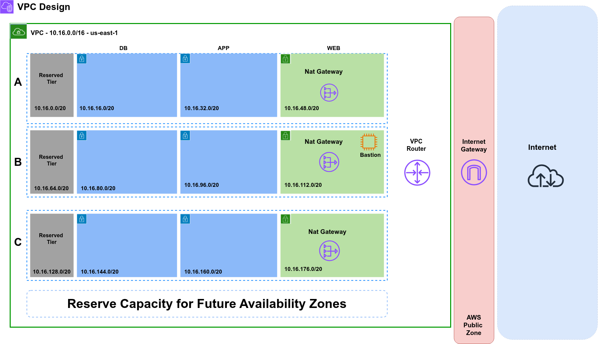

# Production-Ready Three-Tier VPC Architecture

## **Project Objective:** Design and deploy a highly available, secure, and cost-optimized VPC architecture suitable for production e-commerce workloads.

## Project Overview
This project implements a highly available VPC design for a three-tier (Web/App/DB) application. I designed this as part of my AWS Solutions Architect Associate certification preparation to gain hands-on experience with network architecture.

**Key Objectives:**
- Design a scalable VPC supporting multiple Availability Zones
- Implement proper network segmentation for security
- Plan for future growth with reserved CIDR blocks
- Follow AWS best practices for high availability

## Architecture Diagram

---

## VPC Specifications

| Parameter | Value | Description |
|-----------|-------|-------------|
| **VPC CIDR** | `10.16.0.0/16` | 65,536 total IP addresses |
| **Region** | `us-east-1` | N. Virginia |
| **Availability Zones** | `3` | a, b, c |
| **Total Subnets** | `12` | 4 per AZ |
| **Subnet Mask** | `/20` | 4,096 IPs per subnet |

---

## Subnet Design

### Availability Zone A (us-east-1a)

| Subnet Name | CIDR Block | Tier | Type | Purpose |
|-------------|------------|------|------|---------|
| db-a-1 | 10.16.0.0/20 | Database | Private | Primary database |
| db-a-2 | 10.16.16.0/20 | Database | Private | Read replica / standby |
| db-a-3 | 10.16.32.0/20 | Database | Private | Reserved for scaling |
| web-a-1 | 10.16.48.0/20 | Web | Public | NAT Gateway, public resources |

### Availability Zone B (us-east-1b)

| Subnet Name | CIDR Block | Tier | Type | Purpose |
|-------------|------------|------|------|---------|
| app-b-1 | 10.16.64.0/20 | Application | Private | Application servers |
| app-b-2 | 10.16.80.0/20 | Application | Private | Reserved for scaling |
| web-b-1 | 10.16.96.0/20 | Web | Public | Load balancer, web servers |
| web-b-2 | 10.16.112.0/20 | Web | Public | Reserved for scaling |

### Availability Zone C (us-east-1c)

| Subnet Name | CIDR Block | Tier | Type | Purpose |
|-------------|------------|------|------|---------|
| web-c-1 | 10.16.128.0/20 | Web | Public | DR / backup capacity |
| web-c-2 | 10.16.144.0/20 | Web | Public | Reserved for scaling |
| reserved-1 | 10.16.160.0/20 | - | - | Future expansion |
| reserved-2 | 10.16.176.0/20 | - | - | Future expansion |

---

## Network Components

### Core Components

| Component | Quantity | Configuration |
|-----------|----------|---------------|
| **VPC** | 1 | 10.16.0.0/16 |
| **Internet Gateway** | 1 | Attached to VPC |
| **NAT Gateway** | 1 (per design) | Deployed in web-a-1 |
| **Route Tables** | 4 | Public (1), Private (3) |
| **Subnets** | 12 | 4 per AZ |

### Route Tables

**Public Route Table** (associations: web-* subnets)
| Destination | Target | Purpose |
|-------------|--------|---------|
| 10.16.0.0/16 | local | Internal VPC communication |
| 0.0.0.0/0 | igw-xxxxxxxx | Internet access |

**Private Route Tables** (associations: app-* and db-* subnets)
| Destination | Target | Purpose |
|-------------|--------|---------|
| 10.16.0.0/16 | local | Internal VPC communication |
| 0.0.0.0/0 | nat-xxxxxxxx | Outbound internet access |

---

## Security Architecture

### Security Groups (Planned)

| Security Group | Inbound Rules | Outbound Rules | Associated With |
|----------------|---------------|----------------|-----------------|
| **Web-SG** | HTTP (80), HTTPS (443) from 0.0.0.0/0 | All traffic | Web servers, ALB |
| **App-SG** | App port (8080) from Web-SG | All traffic | App servers |
| **DB-SG** | DB port (3306) from App-SG | All traffic | Database instances |
| **Bastion-SG** | SSH (22) from trusted IPs | All traffic | Bastion host |

### Network ACLs (Planned)

**Public Subnet NACL**
| Rule # | Type | Protocol | Port Range | Source/Dest | Allow/Deny |
|--------|------|----------|------------|-------------|------------|
| 100 | HTTP | TCP | 80 | 0.0.0.0/0 | ALLOW |
| 110 | HTTPS | TCP | 443 | 0.0.0.0/0 | ALLOW |
| 120 | Ephemeral | TCP | 1024-65535 | 0.0.0.0/0 | ALLOW |
| * | All | All | All | 0.0.0.0/0 | DENY |

---

## Design Decisions

| Decision | Choice | Alternative Considered | Rationale |
|----------|--------|------------------------|-----------|
| **VPC CIDR** | 10.16.0.0/16 | 10.0.0.0/16 | Avoids overlap with common defaults, room for growth |
| **Subnet Size** | /20 | /24 | 4,096 IPs supports auto-scaling without rearchitecture |
| **AZ Count** | 3 | 2 or 4 | Balance of HA and cost; 3 gives "2+1" redundancy |
| **NAT Gateway** | 1 (AZ-a) | 3 (all AZs) | Cost optimization for learning phase |
| **Reserved Blocks** | 4 subnets | None | Future-proofing for new AZs or expansion |

---

---

## References

- [AWS VPC Documentation](https://docs.aws.amazon.com/vpc/)
- [AWS Well-Architected Framework](https://aws.amazon.com/architecture/well-architected/)
- [VPC CIDR Calculator](https://www.davidc.net/sites/default/subnets/subnets.html)

---

## License

This project is licensed under the MIT License - see the [LICENSE](LICENSE) file for details.

---